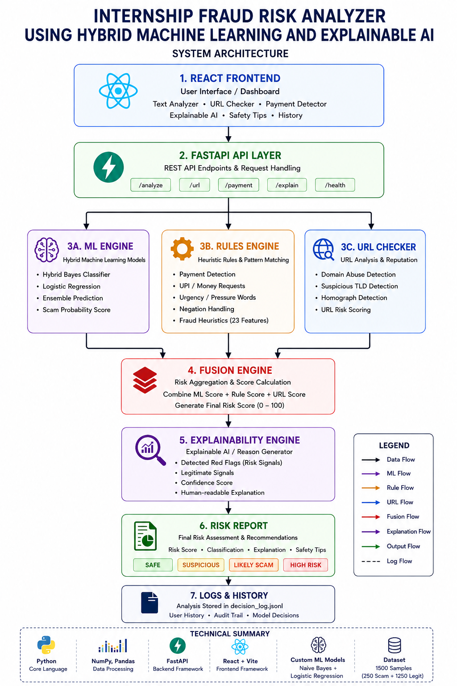

# VeriIntern - Internship Fraud Risk Analyzer

VeriIntern is a hybrid fraud detection system for internship postings. It combines a rule engine, URL analysis, and explainable ML to identify suspicious opportunities that request payments, rely on urgency, or use risky domains.

## Live Demo

Run the application locally with:

```bash
uvicorn main:app --reload
```

Then open the frontend or the served static build in your browser.

## Technology Stack

- Python
- FastAPI
- React + Vite
- Scikit-learn
- NumPy
- Pandas

## Features

- Analyze internship posting text for scam indicators
- Inspect URLs for suspicious structure and trust signals
- Detect payment-related language with negation-aware logic
- Produce human-readable explanations for predictions
- Benchmark the model against a repository dataset

## Architecture



## Performance

| Metric | Value |
| --- | ---: |
| Dataset | 1500 Samples |
| Scam | 250 |
| Legitimate | 1250 |
| Features | 23 |
| Accuracy | 95% |
| Precision | 98% |
| Recall | 90.74% |
| F1 Score | 94.23% |

## Screenshots

- [Home](screenshots/home.png)
- [Dashboard](screenshots/dashboard.png)
- [Docs](screenshots/docs.png)
- [Safety Tips](screenshots/safety-tips.png)
- [Architecture](screenshots/architecture.png)

## Documentation

- [Architecture](docs/architecture.md)
- [API Reference](docs/api.md)
- [Design Decisions](docs/design-decisions.md)

## Future Work

Planned future work includes:

- Docker
- Docker Compose
- Redis
- Kafka
- Kubernetes
- CI/CD
- Prometheus
- OpenTelemetry
- Authentication
- Rate Limiting
